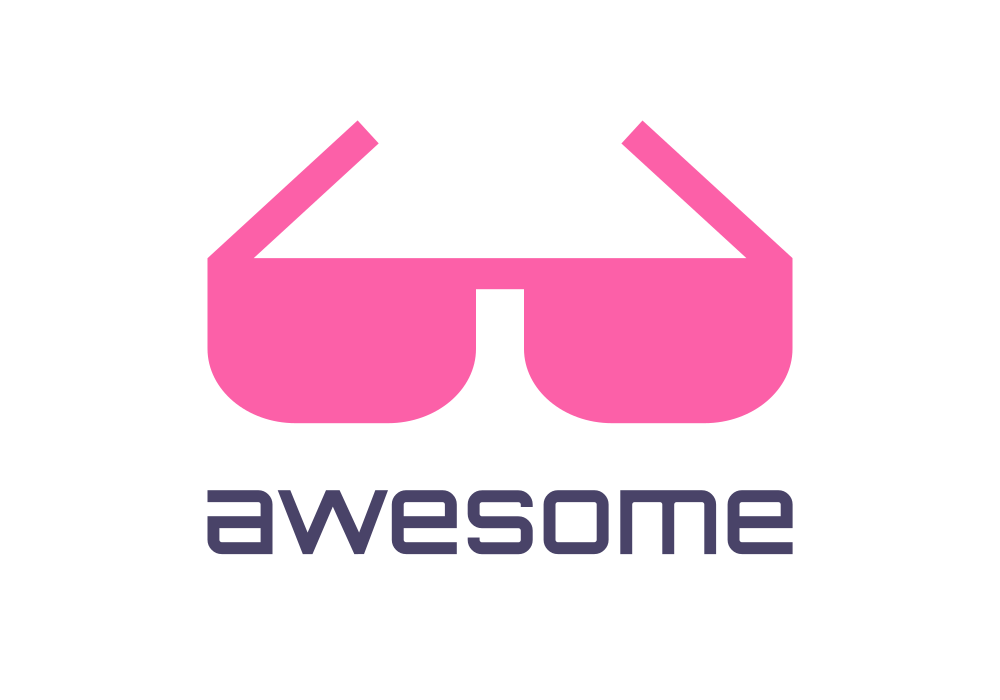
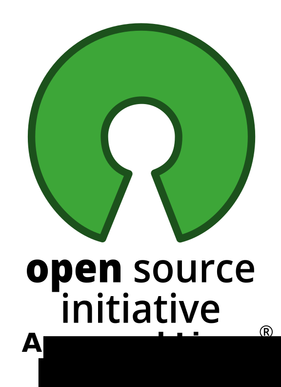

# awesome-open-education

😎 Awesome list about open-source software and open-material in education.

For open-source softwares and programs, only
[OSI approved licences](https://opensource.org/licenses/) are allowed in this
list.

For open educational material(OEM), only [creative commons licences](https://creativecommons.org/share-your-work/cclicenses/) are allowed in this list.

## OSS

### Learning platforms

- [Open edx](https://github.com/edx/): Online learning at https://edx.org, powered by the Open edX platform developed in python and licensed under AGPL-3.0.
- [Moodle](https://github.com/moodle/moodle) the world's open source learning platform developed in php and licensed under GNU General Public
  License.

## OEM

### Knowledge

- [wikipedia](https://wikipedia.org) the famous open encyclopedia licensed under CC-BY-SA.
